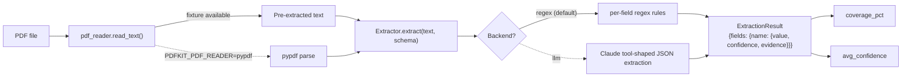

# PDF extraction kit

[](https://github.com/derekgallardo01/pdf-extraction-kit/actions/workflows/ci.yml) [](LICENSE) [](#) [](https://codespaces.new/derekgallardo01/pdf-extraction-kit)

**Docs:** [Getting started](docs/getting-started.md) · [Architecture](docs/architecture.md) · [Customization](docs/customization.md) · [Evaluation](docs/evaluation.md) · [Diagrams](docs/diagrams.md) · [FAQ](docs/faq.md)

**Live demo:** [derekgallardo01.github.io/pdf-extraction-kit](https://derekgallardo01.github.io/pdf-extraction-kit/) — six fixtures across three schemas, with per-field confidence + coverage, regenerated on every push.

Schema-driven PDF extraction with a pluggable backend, per-field
confidence scores, and a golden eval harness that gates CI on exact
extracted values.

Default backend is regex-based — so the kit runs anywhere with zero
keys, zero PDF parser, zero setup. The seam is one method
(`Extractor._extract_llm`); set `PDFKIT_EXTRACTOR=llm` (with
`ANTHROPIC_API_KEY`) to route through Claude.

```bash
pip install -e .
pdfkit demo                              # runs all 6 fixtures
pdfkit list-schemas                      # shows the 3 schemas + fields
pdfkit extract invoice fixtures/invoice-001.pdf
```

```bash
python -m pytest -q     # 23 unit tests covering schemas + extractor + reader
python evals/run.py     # 12 golden eval cases assert exact extracted values
```

Stdlib-only Python on the default path. `pypdf` (for real PDFs) and
`anthropic` (for the LLM backend) are optional extras.

## Run in Docker

```bash
docker build -t pdfkit .
docker run --rm pdfkit                        # runs `pdfkit demo`
docker run --rm pdfkit pytest -q              # runs the tests
docker run --rm pdfkit pdfkit extract invoice fixtures/invoice-001.pdf
```

## What it's for

Real-world PDF extraction work breaks the same way every time:

1. **Engineer writes some regex** that handles the first 5 sample PDFs.
2. **Client ships 1,000 more.** A few have weird date formats. A few
   have the total in a different cell. The regex misses 8% of fields
   and the engineer has no way to know which ones until the client
   complains.
3. **Engineer rewrites with an LLM.** Now they pay per page, the
   output is non-deterministic, there's no test suite to confirm
   nothing regressed when they tweak the prompt, and the LLM
   occasionally hallucinates a value.

This kit solves the third problem by setting the kit up the right
way **before** the LLM swap:

- **Schema-driven** — each document type has a typed schema. The
  extractor knows what fields it's looking for. No "we missed `due_date`
  because we forgot to add it to the regex".
- **Confidence per field** — the extractor returns `{value, confidence,
  evidence}` per field, so the caller can route low-confidence
  extractions to human review.
- **Golden eval harness** — exact-value assertions per fixture per
  field. CI fails if the regex tweaks broke a known extraction.
- **Pluggable backend** — regex by default (deterministic, free, in
  CI); LLM swap via one env var (production accuracy). Same shape
  out, same tests pass.

## Schemas

| Schema | Fields | Example |
|---|---|---|
| `invoice` | invoice_number, dates, vendor, bill_to, subtotal/tax/total, currency, line_items | Vendor invoice with tax + line items |
| `contract` | title, party_a, party_b, effective_date, term_months, renewal, notice_period_days, governing_law | Service / supply agreement |
| `bank_statement` | account_holder, account_number, period, opening/closing_balance, currency, transactions | Bank statement with transaction list |

Adding a new schema is one entry in `src/pdfkit/schemas.py` + per-field
extraction rules in `src/pdfkit/extractor.py`. See
[docs/customization.md](docs/customization.md) for the walkthrough.

## The backend seam

```python
# src/pdfkit/extractor.py
def extract(self, text, schema):
    if self.backend == "llm":
        return self._extract_llm(text, schema)
    return self._extract_regex(text, schema)
```

Everything downstream — confidence scoring, coverage calculation,
evidence tracking, the CLI, the eval harness — is backend-agnostic.
Swap the backend; the same tests pass; the same CLI works.

`_extract_llm` ships with a documented implementation sketch for
the Anthropic SDK. Wire it up when you need LLM-grade accuracy on
tricky PDFs; the regex backend keeps the kit running and CI-gating
in the meantime.

## Architecture



## What `pdfkit demo` looks like

```
[invoice] invoice-001.pdf
  coverage: 100%  confidence: 0.90
    invoice_number         "INV-2026-00482"
    invoice_date           "2026-06-15"
    due_date               "2026-07-15"
    vendor_name            "Acme Widgets Ltd."
    subtotal               769.0
    tax                    153.8
    total                  922.8
    currency               "GBP"
    line_items             [{"description": "Steel ball bearings...", ...}]
```

For the JSON / machine-readable output, append `--json`.

## What's inside

| Path | Purpose |
|---|---|
| `src/pdfkit/schemas.py` | Schema definitions + registry |
| `src/pdfkit/extractor.py` | Regex backend + per-field rules + LLM seam |
| `src/pdfkit/pdf_reader.py` | Fixture-based reader + pypdf fallback |
| `src/pdfkit/cli.py` | `pdfkit demo` / `pdfkit extract` / `pdfkit list-schemas` |
| `fixtures/*.pdf.txt` | 6 pre-extracted PDFs (2 per schema) |
| `tests/` | 23 pytest tests across the surface |
| `evals/golden.json` | 12 golden eval cases |
| `evals/run.py` | Eval harness |
| `pyproject.toml` | Package + `pdfkit` script entry |

## Companion repos

- [rag-over-docs-kit](https://github.com/derekgallardo01/rag-over-docs-kit) — once you've extracted structured data, this is how you ground LLM answers in it (chunking + retrieval + citation).
- [nocode-ai-lead-workflow](https://github.com/derekgallardo01/nocode-ai-lead-workflow) — pairs with extraction when each PDF needs to flow through a classifier + dedupe + human-review queue.
- [m365-audit-mcp](https://github.com/derekgallardo01/m365-audit-mcp) — if your PDFs live in SharePoint, this MCP server is how an agent finds them.
