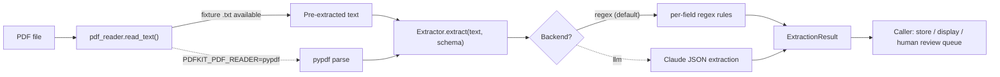
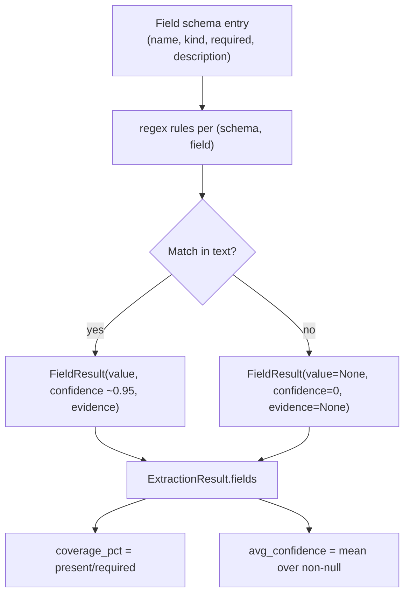
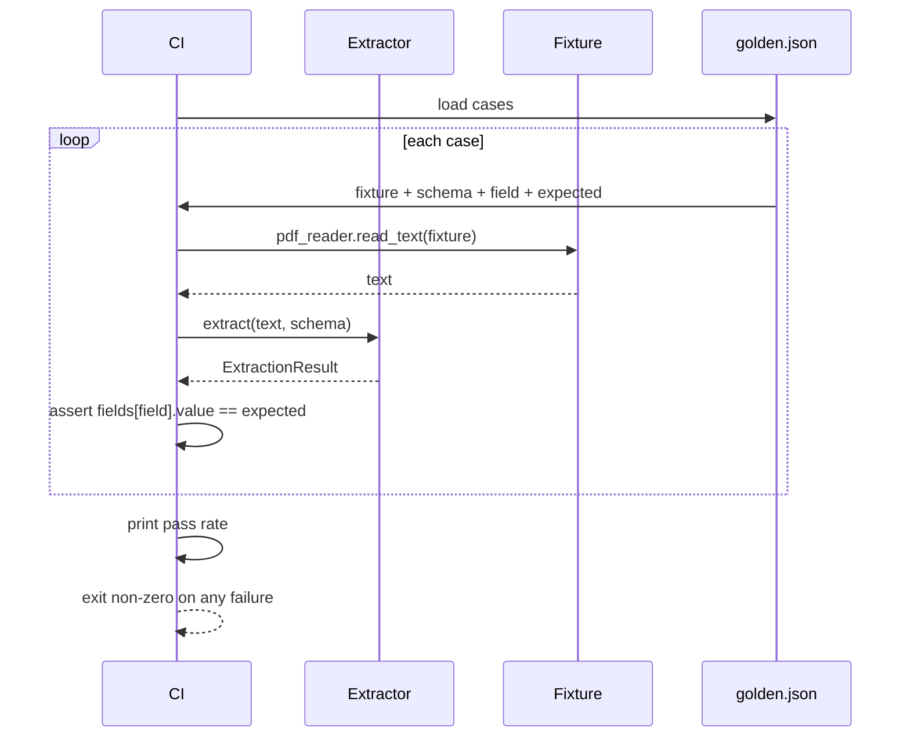
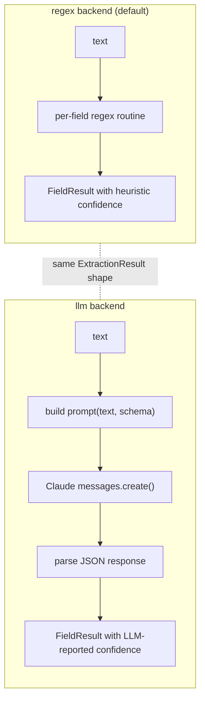
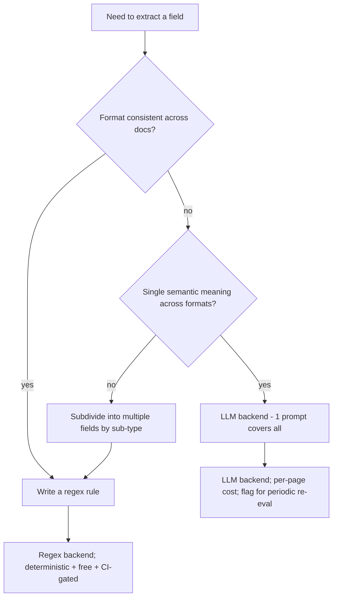
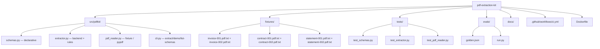

# Diagrams

GitHub renders Mermaid natively. These render on the README and in this file.

## End-to-end pipeline

## Per-field extraction shape

## Schema -> evaluation

## Backend swap (regex vs LLM)

The caller (CLI, eval harness, your own code) never knows which
backend produced the result.

## When to use the LLM backend

## Repo shape

